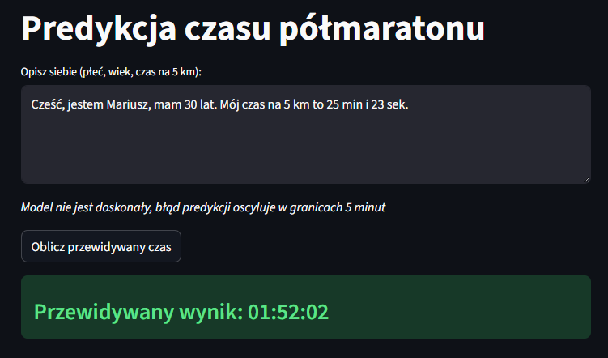

# 🏃‍♂️ Half Marathon Predictor – End-to-End Machine Learning System

System uczenia maszynowego służący do predykcji czasu ukończenia Półmaratonu Wrocławskiego na podstawie wyników biegu na 5 km, wieku oraz płci. Projekt łączy klasyczne modelowanie regresyjne z nowoczesnym podejściem Generative AI (LLM) do parsowania danych użytkownika.



*Celem aplikacji było nauczenie się korzystania z usług w chmurze (Digital Ocean) i monitorowaniem LLM (Langfuse).*

## 🏗️ Architektura Systemu

Projekt został zaprojektowany w oparciu o architekturę chmurową, zapewniającą separację danych, modelu i warstwy prezentacji:

* **Cloud Data Lake:** Wykorzystanie **Digital Ocean Spaces (S3)** do przechowywania surowych danych (CSV) oraz składowania wyeksportowanych artefaktów modeli (`.pkl`).
* **ML Pipeline:** Zautomatyzowany proces przetwarzania danych i trenowania modeli przy użyciu **PyCaret** w Python 3.11.
* **App Layer:** Interaktywna aplikacja webowa zbudowana w **Streamlit**.
* **AI/NLP Layer:** Integracja z **OpenAI API** (GPT) w celu umożliwienia użytkownikom wprowadzania danych w formie tekstu naturalnego.
* **Observability:** Pełny monitoring zapytań i kosztów LLM za pomocą **Langfuse**.
* **Deployment:** Aplikacja wdrożona na **Digital Ocean App Platform**.

---

## 🛠️ Stack Technologiczny

| Kategoria | Technologie |
| :--- | :--- |
| **Język** | Python 3.11 |
| **Data Science** | Pandas, NumPy, PyCaret, Scikit-learn |
| **Cloud & DevOps** | Digital Ocean Spaces, Digital Ocean App Platform, Boto3 |
| **Generative AI** | OpenAI API (GPT-4o-mini) |
| **Monitoring** | Langfuse |
| **Frontend** | Streamlit |

---

## 📈 Cykl Życia Projektu

### 1. Inżynieria Danych (ETL)
* **Pozyskiwanie:** Synchronizacja lokalnych zbiorów danych z chmurą Digital Ocean za pomocą skryptów opartych na `boto3`.
* **Czyszczenie:** Agregacja wyników z różnych edycji Półmaratonu Wrocławskiego (2023-2024), ujednolicenie jednostek czasu (konwersja na sekundy) oraz filtracja błędnych rekordów.

### 2. Modelowanie (AutoML)
Wykorzystałem bibliotekę **PyCaret** do przeprowadzenia eksperymentów:
* Porównanie kilkunastu algorytmów regresyjnych (m.in. Linear Regression, Random Forest, LightGBM).
* Finalizacja modelu **Gradient Boosting Regressor**, który wykazał najlepszy stosunek precyzji do zdolności generalizacji.
* Zapisanie modelu jako artefakt bezpośrednio do chmury S3.

### 3. Interfejs Użytkownika i AI
Kluczową cechą aplikacji jest **Natural Language Input**. Użytkownik nie musi wypełniać sztywnego formularza. Może napisać:
> *"Mam 28 lat, jestem mężczyzną i biegam 5km w 24 minuty i 15 sekund."*

Model LLM (OpenAI) ekstrahuje z tego zdania parametry: 
```
{
"age": 28,
"gender": "mężczyzna",
"time_5km": 1455
}
```
które następnie zasilają model ML.

### 4. Monitoring i Bezpieczeństwo
Dzięki integracji **Langfuse**, każda próba predykcji jest monitorowana pod kątem:
* Poprawności parsowania danych przez LLM.
* Czasu odpowiedzi (latency) i zużycia tokenów (kosztów).
* Historii zapytań, co pozwala na ciągłe doskonalenie promptów systemowych.

---

Aplikacja jest w pełni skonteneryzowana i zoptymalizowana pod **Digital Ocean App Platform**.

Ze względu na koszty utrzymania aplikacji została usunięta z `Digital Ocean`.

<a href="https://github.com/AmitrialYoung/halfmarathon" class="md-button md-button--primary">Repozytorium GitHub</a>